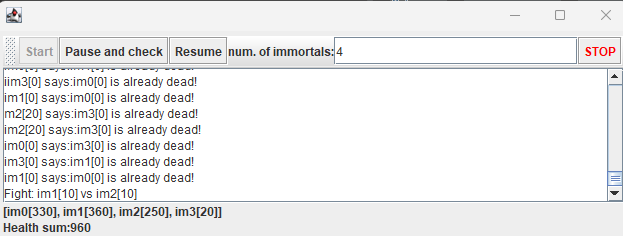
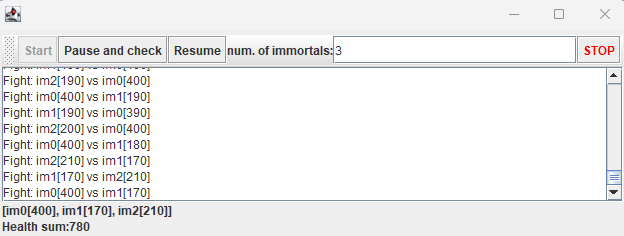
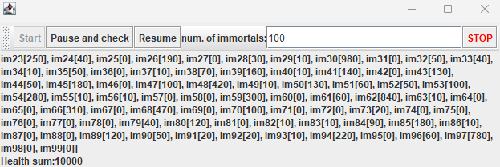
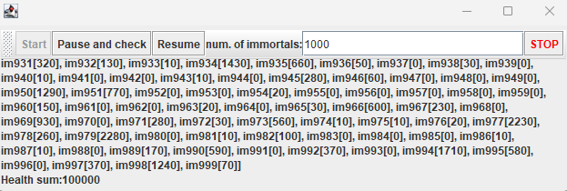
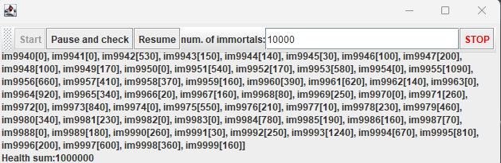

## Escuela Colombiana de Ingeniería

### Arquitecturas de Software – ARSW

#### Ejercicio – programación concurrente, condiciones de carrera y sincronización de hilos. EJERCICIO INDIVIDUAL O EN PAREJAS.

#### Jefer Alexis Gonzalez Romero

##### Parte I – Antes de terminar la clase.

Control de hilos con wait/notify. Productor/consumidor.

1. Revise el funcionamiento del programa y ejecútelo. Mientras esto ocurren, ejecute jVisualVM y revise el consumo de CPU del proceso correspondiente. A qué se debe este consumo?, cual es la clase responsable?


> El programa hace uso del 13% de la CPU, el responsable de esto es la clase Consumer, debido a que en cada iteración se valida la condición de que haya más de un elemento en la cola para consumir, esto sin importar que la cola esté vacía. Además, esto pasa seguido debido a que se produce un nuevo elemento cada segundo, durante este tiempo la cola pertenece vacia y el consumidor sigue haciendo la validación.

2. Haga los ajustes necesarios para que la solución use más eficientemente la CPU, teniendo en cuenta que -por ahora- la producción es lenta y el consumo es rápido. Verifique con JVisualVM que el consumo de CPU se reduzca.


> Cada vez que Consumer consume un elemento descansa haciendo uso de queue.wait() teniendo la cola en la cual están los elementos como monitor. En el caso de producer cada vez que genera un nuevo elemento despierta a Consumer con notify.

3. Haga que ahora el productor produzca muy rápido, y el consumidor consuma lento. Teniendo en cuenta que el productor conoce un límite de Stock (cuantos elementos debería tener, a lo sumo en la cola), haga que dicho límite se respete. Revise el API de la colección usada como cola para ver cómo garantizar que dicho límite no se supere. Verifique que, al poner un límite pequeño para el 'stock', no haya consumo alto de CPU ni errores.


> Ahora se produce un elemento cada segundo y se consume cada dos segundo. Además, con el fin de cumplir la condición de que la cola tenga un límite de elementos se usa un constructor de LinkedBlockingQueue donde se puede dar su capacidad como parámetro. De igual forma, en Producer se añade queue.wait() para que mientras este llena la cola duerma y cuando Consumer consuma un elemento va a usar notify para despertar al productor. 


> Se prueba con un límite pequeño para el "stock" de 2, no se generaron errores y el consumo de CPU no fue alto (0,0%)


##### Parte II. – Avance para el jueves, antes de clase.

Sincronización y Dead-Locks.


1. Revise el programa “highlander-simulator”, dispuesto en el paquete edu.eci.arsw.highlandersim. Este es un juego en el que:

	* Se tienen N jugadores inmortales.
	* Cada jugador conoce a los N-1 jugador restantes.
	* Cada jugador, permanentemente, ataca a algún otro inmortal. El que primero ataca le resta M puntos de vida a su contrincante, y aumenta en esta misma cantidad sus propios puntos de vida.
	* El juego podría nunca tener un único ganador. Lo más probable es que al final sólo queden dos, peleando indefinidamente quitando y sumando puntos de vida.

2. Revise el código e identifique cómo se implemento la funcionalidad antes indicada. Dada la intención del juego, un invariante debería ser que la sumatoria de los puntos de vida de todos los jugadores siempre sea el mismo(claro está, en un instante de tiempo en el que no esté en proceso una operación de incremento/reducción de tiempo). Para este caso, para N jugadores, cual debería ser este valor?.

> Para N jugadores el valor va ser N * 100, donde 100 es la vida que tiene por defecto un inmortal.

3. Ejecute la aplicación y verifique cómo funcionan las opción ‘pause and check’. Se cumple el invariante?.

<p align="center">
    
</p>

> No se cumple la invariante en este caso hay 4 inmortales y la suma de sus vidas da 960, debería ser 400.

4. Una primera hipótesis para que se presente la condición de carrera para dicha función (pause and check), es que el programa consulta la lista cuyos valores va a imprimir, a la vez que otros hilos modifican sus valores. Para corregir esto, haga lo que sea necesario para que efectivamente, antes de imprimir los resultados actuales, se pausen todos los demás hilos. Adicionalmente, implemente la opción ‘resume’.

> Cuando se oprime el botón "Pause and Check" todos los inmortales se duermen con immortalsPopulation.wait(), después al oprimir el botón resume se despierta a todos los inmortales con immortals.notifyAll(). Para asegurar que primero se duerman todos los hilos antes de calcular la suma de las vidas se usa un AtomicInteger como contador que se incrementa cuando los hilos se van a dormir y mientras el valor de este sea menor que el total de inmortales no sumara sus vidas.

5. Verifique nuevamente el funcionamiento (haga clic muchas veces en el botón). Se cumple o no el invariante?.

<p align="center">
    
</p>

> Aún no se cumple la invariante, se pausan todos los hilos pero la suma de estos no es igual a N * 100.

6. Identifique posibles regiones críticas en lo que respecta a la pelea de los inmortales. Implemente una estrategia de bloqueo que evite las condiciones de carrera. Recuerde que si usted requiere usar dos o más ‘locks’ simultáneamente, puede usar bloques sincronizados anidados:

	```java
	synchronized(locka){
		synchronized(lockb){
			…
		}
	}
	```
> La región crítica es cuando un inmortal ataca a otro (método fight) en este se sincronizarán anidadamente los dos inmortales.

7. Tras implementar su estrategia, ponga a correr su programa, y ponga atención a si éste se llega a detener. Si es así, use los programas jps y jstack para identificar por qué el programa se detuvo.


> El programa se detuvo en los métodos fight de los inmortales im0 e im1, cada uno se tiene bloqueado y está esperando a bloquear al otro. 

8. Plantee una estrategia para corregir el problema antes identificado (puede revisar de nuevo las páginas 206 y 207 de _Java Concurrency in Practice_).

> Como cada inmortal tiene un nombre diferente, lo usaré para que a la hora de un ataque se comparen el nombre del atacante y del que recibe el ataque, el mayor se bloqueará primero y el menor después de este. 

9. Una vez corregido el problema, rectifique que el programa siga funcionando de manera consistente cuando se ejecutan 100, 1000 o 10000 inmortales. Si en estos casos grandes se empieza a incumplir de nuevo el invariante, debe analizar lo realizado en el paso 4.

<p align="center">
    
</p>

> Con 100 inmortales la suma total de la vida de estos debe ser 100 * 100 = 10000.

<p align="center">
    
</p>

> Con 1000 inmortales la suma total de la vida de estos debe ser 1000 * 100 = 100000.

<p align="center">
    
</p>

> Con 100 inmortales la suma total de la vida de estos debe ser 10000 * 100 = 1000000.

10. Un elemento molesto para la simulación es que en cierto punto de la misma hay pocos 'inmortales' vivos realizando peleas fallidas con 'inmortales' ya muertos. Es necesario ir suprimiendo los inmortales muertos de la simulación a medida que van muriendo. Para esto:
	* Analizando el esquema de funcionamiento de la simulación, esto podría crear una condición de carrera? Implemente la funcionalidad, ejecute la simulación y observe qué problema se presenta cuando hay muchos 'inmortales' en la misma. Escriba sus conclusiones al respecto en el archivo RESPUESTAS.txt.
	* Corrija el problema anterior __SIN hacer uso de sincronización__, pues volver secuencial el acceso a la lista compartida de inmortales haría extremadamente lenta la simulación.
> Sí crea una condición de carrera el suprimir los inmortales cuando mueren, ya que de acuerdo a cómo se acceda a la lista de inmortales y cómo se modifique puede alterar la invariante establecida, dependiendo este resultado de cuál de los hilos en ejecución llega primero o realiza una operación antes que los demás. Para solucionar lo anterior se hará uso de una estructura de datos concurrente no bloqueante, para garantizar que múltiples hilos puedan acceder a la lista de inmortales de manera ordenada y controlada.
> En este caso se hace uso de **CopyOnWriteArrayList**, que es una lista concurrente que permite lecturas concurrentes sin bloqueos y garantiza que las operaciones de escritura sean seguras mediante la copia de la lista cuando se realiza una operación de escritura.

11. Para finalizar, implemente la opción STOP.

> Se le agrega el evento al botón de STOP, el cual al oprimirlo itera sobre todos los inmortales para que terminen su ejecución, después se vuelve a habilitar el botón de Start.

<!--
### Criterios de evaluación

1. Parte I.
	* Funcional: La simulación de producción/consumidor se ejecuta eficientemente (sin esperas activas).

2. Parte II. (Retomando el laboratorio 1)
	* Se modificó el ejercicio anterior para que los hilos llevaran conjuntamente (compartido) el número de ocurrencias encontradas, y se finalizaran y retornaran el valor en cuanto dicho número de ocurrencias fuera el esperado.
	* Se garantiza que no se den condiciones de carrera modificando el acceso concurrente al valor compartido (número de ocurrencias).


2. Parte III.
	* Diseño:
		- Coordinación de hilos:
			* Para pausar la pelea, se debe lograr que el hilo principal induzca a los otros a que se suspendan a sí mismos. Se debe también tener en cuenta que sólo se debe mostrar la sumatoria de los puntos de vida cuando se asegure que todos los hilos han sido suspendidos.
			* Si para lo anterior se recorre a todo el conjunto de hilos para ver su estado, se evalúa como R, por ser muy ineficiente.
			* Si para lo anterior los hilos manipulan un contador concurrentemente, pero lo hacen sin tener en cuenta que el incremento de un contador no es una operación atómica -es decir, que puede causar una condición de carrera- , se evalúa como R. En este caso se debería sincronizar el acceso, o usar tipos atómicos como AtomicInteger).

		- Consistencia ante la concurrencia
			* Para garantizar la consistencia en la pelea entre dos inmortales, se debe sincronizar el acceso a cualquier otra pelea que involucre a uno, al otro, o a los dos simultáneamente:
			* En los bloques anidados de sincronización requeridos para lo anterior, se debe garantizar que si los mismos locks son usados en dos peleas simultánemante, éstos será usados en el mismo orden para evitar deadlocks.
			* En caso de sincronizar el acceso a la pelea con un LOCK común, se evaluará como M, pues esto hace secuencial todas las peleas.
			* La lista de inmortales debe reducirse en la medida que éstos mueran, pero esta operación debe realizarse SIN sincronización, sino haciendo uso de una colección concurrente (no bloqueante).

	

	* Funcionalidad:
		* Se cumple con el invariante al usar la aplicación con 10, 100 o 1000 hilos.
		* La aplicación puede reanudar y finalizar(stop) su ejecución.
		
		-->

<a rel="license" href="http://creativecommons.org/licenses/by-nc/4.0/"></a><br />Este contenido hace parte del curso Arquitecturas de Software del programa de Ingeniería de Sistemas de la Escuela Colombiana de Ingeniería, y está licenciado como <a rel="license" href="http://creativecommons.org/licenses/by-nc/4.0/">Creative Commons Attribution-NonCommercial 4.0 International License</a>.
